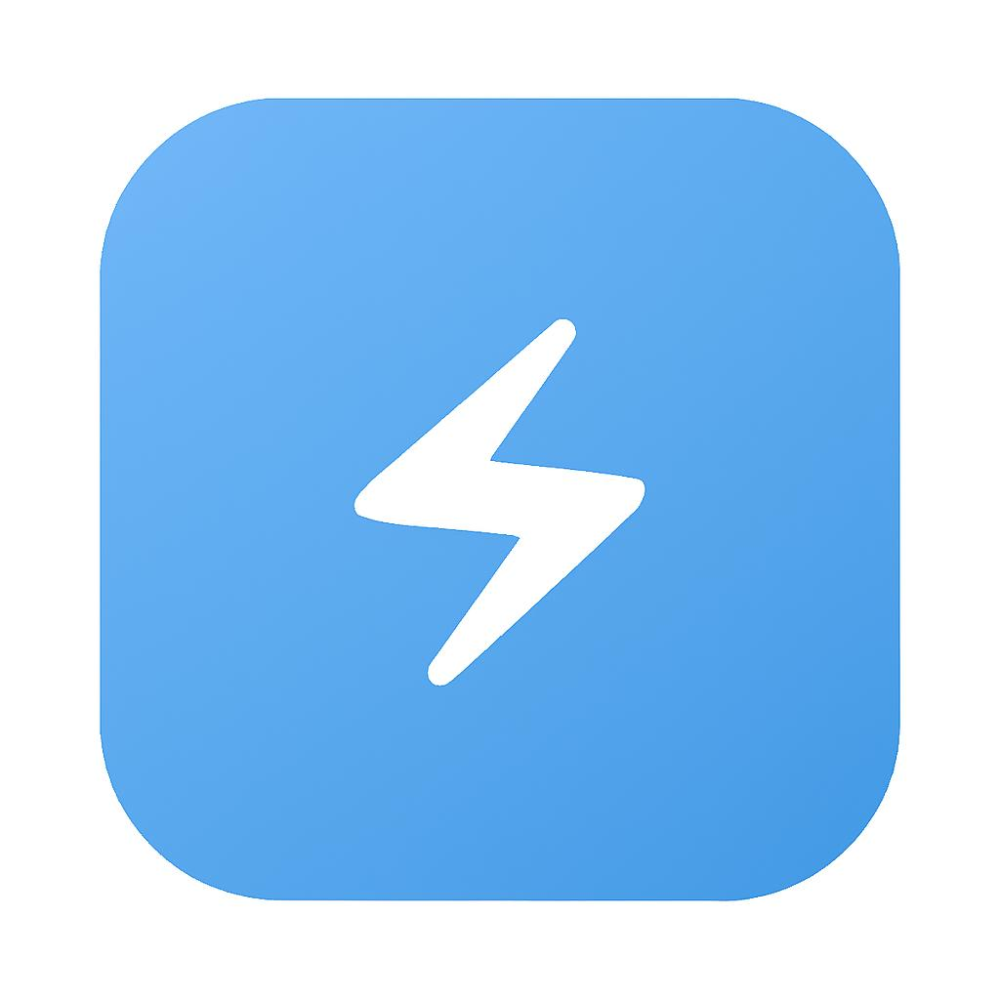

# ELECON - Sistem Monitoring Listrik Kampus

<div align="center">


[](http://makeapullrequest.com)

</div>

<p align="center">
  
</p>

## 📱 Overview

ELECON adalah aplikasi monitoring konsumsi listrik kampus berbasis Flutter yang memungkinkan:
- 📊 Pemantauan konsumsi listrik secara real-time
- 📈 Analisis tren penggunaan listrik
- 🔔 Notifikasi penggunaan berlebih
- 📱 Antarmuka yang modern dan responsif

## 🎯 Fitur Utama

- **Monitoring Real-Time:** Lihat konsumsi listrik terkini setiap ruangan.
- **Statistik Konsumsi:** Grafik perbandingan konsumsi listrik bulanan.
- **Notifikasi Otomatis:** Peringatan jika konsumsi melebihi batas.
- **Integrasi Firebase:** Penyimpanan dan pengambilan data dengan Firestore.
- **Visualisasi Data:** Grafik interaktif untuk analisis tren konsumsi listrik.
- **QR Code Scanner:** Kelola status alat listrik melalui pemindaian QR code.

## 🛠️ Teknologi yang Digunakan

### Core
- **Flutter SDK** - Framework UI cross-platform
- **Dart** - Bahasa pemrograman modern dan powerful
- **Firebase** - Backend dan database realtime

### State Management & Services
- **Provider** - Manajemen state yang ringan dan efisien
- **Firebase Firestore** - Database NoSQL untuk data realtime
- **Firebase Auth** - Autentikasi pengguna
- **Connectivity Plus** - Deteksi konektivitas internet

### UI/UX
- **Material Design 3** - Design system modern dari Google
- **Custom Widgets** - Komponen UI yang reusable
- **Charts** - Visualisasi data interaktif
- **QR Scanner** - Pemindaian kode QR untuk manajemen perangkat

## 📁 Struktur Proyek

```
lib/
├── main.dart                 # Entry point aplikasi
├── models/                   # Model data
│   ├── alat_model.dart
│   ├── monitoring_data.dart
│   └── ruang_model.dart
├── providers/               # State management
│   └── monitoring_provider.dart
├── screens/                 # UI screens
│   ├── monitoring_screen.dart
│   ├── statistik_screen.dart
│   └── ...
├── services/               # Backend services
│   ├── firestore_service.dart
│   └── pdf_export_service.dart
├── theme/                  # Styling
│   └── colors.dart
├── utils/                  # Helper functions
│   └── utils.dart
└── widgets/               # Reusable components
    ├── alat_card.dart
    ├── bar_chart_widget.dart
    └── ...
```

## ⚙️ Instalasi & Pengembangan

### Prerequisites

- Flutter SDK 3.0+
- Dart SDK 3.0+
- Android Studio / VS Code
- Firebase Project

### Langkah Instalasi

1. **Clone repository:**
   ```sh
   git clone https://github.com/yourusername/elecon.git
   cd elecon
   ```

2. **Install dependencies:**
   ```sh
   flutter pub get
   ```

3. **Konfigurasi Firebase:**
   - Buat project di [Firebase Console](https://console.firebase.google.com/)
   - Download `google-services.json` untuk Android
   - Download `GoogleService-Info.plist` untuk iOS
   - Letakkan file konfigurasi di folder yang sesuai:
     - Android: `android/app/google-services.json`
     - iOS: `ios/Runner/GoogleService-Info.plist`

4. **Setup Environment Variables (opsional):**
   ```sh
   cp .env.example .env
   # Edit .env sesuai konfigurasi Anda
   ```

5. **Jalankan aplikasi:**
   ```sh
   flutter run
   ```

### Build Release

1. **Android:**
   ```sh
   flutter build apk --release
   # atau
   flutter build appbundle --release
   ```

2. **iOS:**
   ```sh
   flutter build ips --release
   ```

## 🤝 Kontribusi

Kontribusi sangat diapresiasi! Berikut beberapa cara untuk berkontribusi:

1. Fork repository ini
2. Buat branch baru (`git checkout -b feature/AmazingFeature`)
3. Commit perubahan Anda (`git commit -m 'Add some AmazingFeature'`)
4. Push ke branch (`git push origin feature/AmazingFeature`)
5. Buka Pull Request

## 📝 Lisensi

Didistribusikan di bawah Lisensi MIT. Lihat [`LICENSE`](LICENSE) untuk informasi lebih lanjut.

## 📧 Kontak

Nama Anda - [@twitter_handle](https://twitter.com/twitter_handle) - email@example.com

Project Link: [https://github.com/yourusername/elecon](https://github.com/yourusername/elecon)

## 🙏 Acknowledgments

* [Flutter](https://flutter.dev)
* [Firebase](https://firebase.google.com)
* [Provider](https://pub.dev/packages/provider)
* [fl_chart](https://pub.dev/packages/fl_chart)
* [qr_code_scanner](https://pub.dev/packages/qr_code_scanner)

---

> 💻 Dibuat dengan ❤️ untuk tugas besar Mobile Programming
